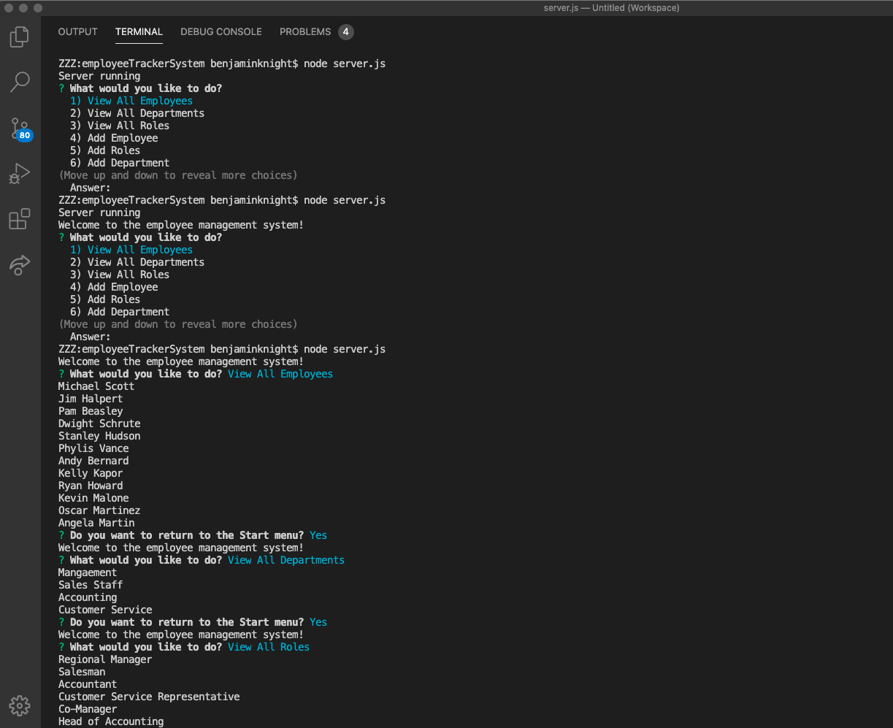

# Employee Management System




## Description

This employee management system can track and add employees, departments, and roles. It will also allow the user to update a current roles information, and also change an employee's role.
This system will update every time a change is made, or an item is added.

## Installation

```
npm install
```

## Usage

To begin using the application, simple type 

```
node server.js
```
and the app will walk you through the rest.

## Contributing

Ben Knight
